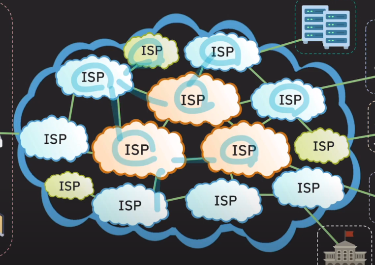

# 인터넷 프로토콜 스택

인터넷 프로토콜은 5계층으로 되어져있다.

## 1. 어플리케이션 계층

서로 다른 종단 시스템에 있는 어플리케이션끼리 정보 패킷을 교환하는데 사용하는 프로토콜이 여기 계층에 있다.

대표적으로 HTTP(웹 문서), SMTP(메일 전송), FTP(파일 전송) 프로토콜이 있다.
DNS도 여기 존재한다.

## 2. 트랜스포트 계층

클라이언트와 서버 간에 어플리케이션 계층의 메세지를 전송하는 서비스를 제공하는 계층

대표적으로 TCP, UDP 프로토콜이 존재한다.

TCP 계층은 연결지향하고 3-way handshake를 통해 신뢰성을 확보하는 방식으로 동작한다.

UDP 계층은 비연결지향이고 handshake 과정이 없기 때문에 비신뢰성이고 빠르게 데이터를 주고 받을 때 사용한다.

## 3. 네트워크(IP) 계층

서로 다른 호스트끼리 데이터그램을 라우팅하는 책임을 진다.

즉 목적지를 알려주는 모든 서비스를 제공한다고 보면된다.

## 4. 링크 계층

링크 계층에 패킷을 프레임이라고 하는데 서로 다른 노드로 패킷을 이동시키기 위해서는 네트워크 계층은 링크 계층에 의존해야한다.

## 5. 물리 계층

프레임 내부의 각 비트를 서로 다른 노드로 이동시켜준다.

# 캡슐화

