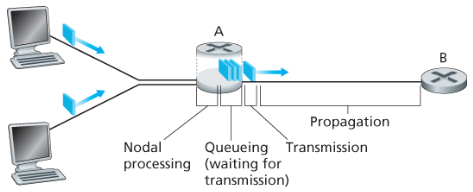

## 목차

[1.4.0 개요](#140-개요)  [1.4.1 패킷 교환 네트워크에서의 지연 개요](#141-패킷-교환-네트워크에서의-지연-개요)  [1.4.2 큐잉 지연과 패킷 손실](#142-큐잉-지연과-패킷-손실)  [1.4.3 종단간 지연](#143-종단간-지연) 

## 1.4.0 개요

목표:

- 컴퓨터 네트워크에서의 지연, 손실, 처리량을 알아보자

---

## 1.4.1 패킷 교환 네트워크에서의 지연 개요

패킷은 경로상의 각 노드 (호스트 혹은 라우터)에서 다양한 지연을 겪게 된다. 이들 지연에서 중요한 것으로는 `노드 처리 지연 (nodal processing delay)`, `큐잉 지연 (queuing delay)`, `전송 지연 (transmission delay)`, `전파 지연 (propagation delay)` 을 들 수 있으며 이 지연들이 쌓여서 `전체 노드 지연 (total nodal delay)` 을 일으킨다. 패킷 교환과 컴퓨터 네트워크를 잘 이해하려면 이 지연들에 때한 특성과 중요성을 잘 이해해야 한다.
 

라우터 A는 패킷에 대한 출력 링크를 결정하기 위해 패킷 헤더를 조사하고 선택된 링크로 그 패킷을 보낸다. 링크에 현재 전송되는 다른 패킷이 존재하지 않을 때 동시에 큐(출력버퍼)에 자신보다 앞선 다른 패킷이 없으면 링크로 전송될 수 있다.

### 노드 처리 지연

> 패킷 헤더를 조사, 어디로 보낼지를 결정하는 시간

더하여 노드에서 라우터A로의 패킷의 비트 수준 오류를 조사하는데 필요한 시간과 같은 다른 요소가 포함될 수도 있다.

### 큐잉 지연

> 패킷이 큐에서 링크로 전송되기를 기다리는 시간

이는 앞서 도착한 다른 패킷의 수에 의해 결정될 수 있다. 큐가 비어있고 다른 패킷이 전송중이 아니라면 큐잉 지연은 0이다.

### 전송 지연

> 라우터의 큐에서 패킷이 선입선출 될 때 패킷의 모든 비트를 링크로 밀어내는데(전송하는데) 필요한 시간

라우터A에서 라우터B까지 링크의 전송률은 R bps 이며 이 전송률에 따른다. 패킷의 길이와 링크 전송률의 함수이다.

### 전파 지연

> 이전 링크의 처음부터 라우터B까지의 전파에 필요한 시간

비트는 링크의 전파속도로 전파된다. 전파속도는 링크의 물리 매체(광섬유, 꼬임쌍선)에 따라 범위를 갖는다. 두 라우터 사이의 거리에 대한 함수이다.

---

## 1.4.2 큐잉 지연과 패킷 손실

- 큐잉 지연은 패킷의 길이, 전송률, 트래픽의 강도에 따라 달라질 수 있다. 큐의 용량은 유한하며, 트래픽의 강도가 커질 수록 큐의 길이 또한 증가한다.
- 큐의 용량은 스위치 설계와 비용에 의존하며 유한하다. 패킷을 저장할 수 없는 경우에 라우터는 그 패킷을 버린다(drop). 즉 그 패킷을 잃어버리게 된다(lost)
- 이후 논의되겠지만 손실 패킷은 모든 데이터가 궁극적으로 출발지에서 목적지까지 전달되었다는 것을 보장하기 위해 종단간에 재전송 될 수 있다.

---

## 1.4.3 종단간 지연

추가적인 지연이 발생할 수 있는데 프로토콜이 일부로 전송을 의도적으로 지연시키거나 송신측 VoIP에서 패킷을 먼저 인터넷으로 보내기 전에 encoded된 디지털 음성으로 패킷을 채우는 시간이 소요될 수 있다.
