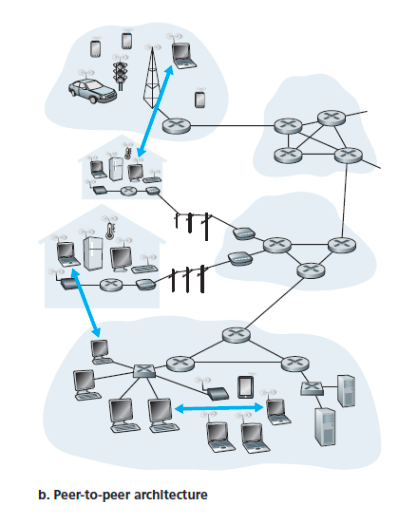

## Overview

- Principles of network applications
- Web and HTTP
- Email, SMTP, IMAP
- The Domain Name System (DNS)
- P2P applications
- Video straming and content distribution networks
- Socket programming with UDP and TCP

### 2.1.1 Network Application Architectures

#### Application Architecture

Application architecture is designed by the application develper and dictates **how the application is structured over the various end ststems**: the client-server architecture or the peer-to-peer (P2P) architecture.

#### Client-Server Architecture

There is an always on host, called server, which serivices requests from many other hosts, called clients. When a server receives a request for an object from a client host, it responds by sending the requested object to the client host.

##### Characteristics of client-server architecture

- Clients do not directy communicate with each other. For examples, two browsers do not directly communicate.
- The server has **a fixed, well-known address**, and becaus the server is always on, a cliern can always contact the server by sending a packet to the server's IP address.
- A **data center**, housing a large number of hosts, is able to create a powerful virtual server hwen a single-server host is in incapable of keeping up all the requests from clients, such as popular Internt Services, Google.

#### P2P Architecture

P2P architecture has minimal reliance on a server, but it directly communicate with peers.

- Peers are the pairs of intermittently connectd hosts
- The peers are not owned by the service provider, such as dektops and laptops that are controlled by users
- Peers communicate without passing through a dedicated server, the architecture is called peer-to-peer

Many of today's most popular and traffic-intensive applications are based on P2P architectures.

- The applications include file sharing, peer-assisted download accleration, and Internet telephoney and video conference
- Torrent, Skype

##### Characteristics of P2P architecture

- Self-scalability: P2P file-sharing application, although each peer generates workload by requesting files, each peer also adds service capacity to the system by distributing files to other peers
- Cost-effective: nomally don't requre significant server infrastructure and sever bandwidth (in contranst with client-server designs with data centers)
- However, face challenges of security, performance, and reliability due to their highly decentralized structure

### 2.1.2 Processes Communicating
