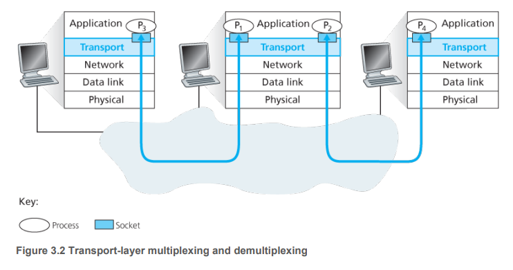

## **Overview**

To concreate the disccusion, we will discuss the basic transport-layer service in the context of the Internet.

At the destination host, the transport layer receives segments from the network layer just below. The transport layer has the **responsibility** of delivering the data in these segments to the appropriate application process running in the host.

### Summary of multiplexing and demultiplexing

- A process (as part of a network application) can have one or more **sockets**, doors through which data passes from the network to the process and through which data passes from the process to the network.
- Thus, the transport layer in the receiving host does not actually deliver data directly to a process, *but instead to an intermediary socket*.
- Because at any given time there can be more than one socket in the receiving host, each socket has a unique identifier. The format of the identifier depends on whether the socket is a UDP or a TCP socket.
- 소켓은 네트워크에서 프로세스로, 프로세스에서 네트워크로 데이터를 전달하는 문의 역할을 한다.
- Transport-layer에서 호스트는 데이터를 직접 받지 않고 소켓을 통해 받는다.

### How a receiving host directs an incoming transport-layer segment to the appropriate socket?

- Each transport-layer segment has a set of fields in the segment to receive the sockets.
- At the receieving end, the transport layer examines these fields to identify the receiving socket and then directs the segment to that socket.
- This job of delivering the data in a transport-layer segment to the correct socket is called **demultiplexing**.
- This job of gathering data chunks at the source host from different sockets, encapsulating each data chunk with header information (that will later be used in demultiplexing) to create segments, and passing the segments to the network layer is called **multiplexing**.
