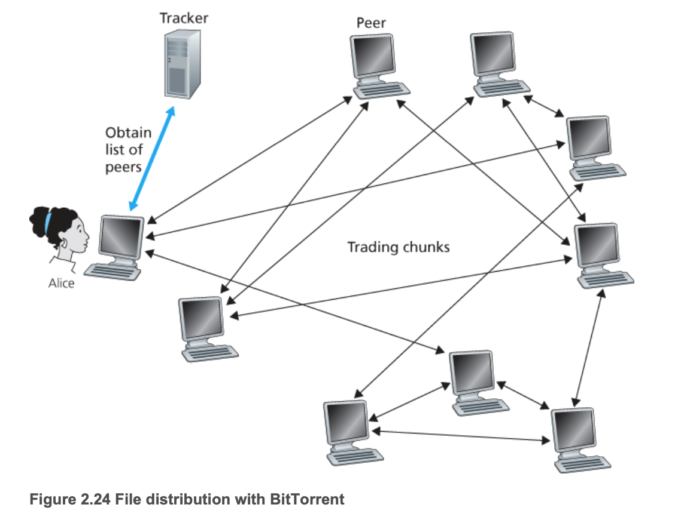

## Overview

As we mentioned about P2P architecture in section 2.1.1, P2P architectrue has minimal reliance on the server or infrastructure. Instead, pairs of intermittently connected hosts, called peers, communicate directly with each other. The peers are not owned by a service provider, but are instead desktops and laptops controlled by users.

Here we distribute a large file from a single server to a large number of hosts (called peers).

In P2P file distribution, each peer can redistribute any portion of the file it has received to any other peers, thereby assisting the server in the distribution process.

### Scalability of P2P Architectures

New peers bring new service capacity, and service demands.

### BitTorrent

BitTorrent is a popular P2P protocol for file distribution.

#### How BitTorrent works?

The collection of all peers participating in the distribution of a particular files is called a *torrent*. Peers in a torrent download equal-size chunks of the file from one another, with a typical chuck size of 256 KB.

When a peer first joins a torrent, it has no chunks. Over time it accumulates more and more chunks. While it downloads chunks it also uploads chunks to other peers.

Onec a peer has acquired the entire file, it may leave the torrent (selfishly), or remain in the torrent and continue to upload chunks to other peer. Also, any peer may leave the torrent at any time with only a subset of chunks, and later rejoin the torrent.

#### Example

