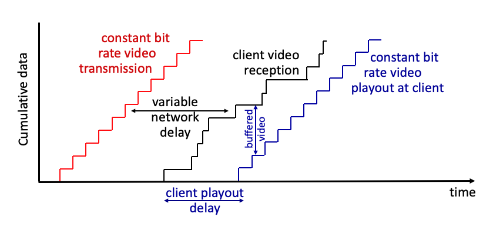
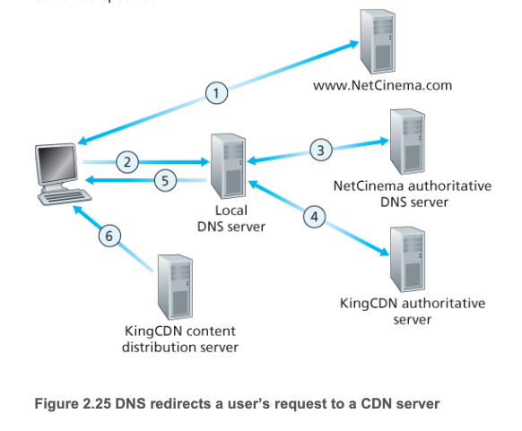

## 2.6.1 Internet Video

### Definition of Video

A video is a sequence of images, typically being displayed at a constant rate, for example, at 24 or 30 images per sec.

### Charateristics of video

- Video compression: it can be compressed, thereby trading off video quality with bit rate. The higher the bit rate, the better the image quality and the better the overall user viewing experience.
- An average thorughput: in order to provide continuous playout, the network must provide an average throughput to the streaming application that is at least as the bit rate of the compressed video.

## 2.6.2 HTTP Streaming and DASH

### HTTP Streaming

#### How it works?

- The video is simply stored at an HTTP server as an ordinary file with a specific **URL**.
- When a user wants to see the video, the client establishes a TCP connection with the server and issues an HTTP GET request for that URL.
- On the client side, the butes are collected in a client application buffer.
  - A buffer is a temporarliy space where collect video frames.
- Once the number of bytes in this buffer exceeds a predetermined threshold, the client application begins playback - specifially, the streaming video application periodically grabs video frames from the client application buffer, decompresses the frames, and displays them on the user's screen.

#### Shortcoming

All clients receive the same encoding of the video, despite the large varications in the amount of bandwidth available to a client, both across different clients and also over time for the same client.

### Dynamic Adaptive Streaming over HTTP (DASH)

The video is encoded into several different versions, with each version having a different bit rate and, correspondingly, **a different quality level**.

- When the amount of available bandwidth is high, the client naturally selects chunks from a high-rate version.
- When the amount of available bandwidth is low, it naturally selects from a low-rate version.

## Content Distribution Networks (CDNs)

How to stream content to hundreds of thousands of simultaneous users?

CDNs manages servers in multiple geocraphically distributed locations, store copies of the videos (and other types of Web content, including documents, images, and audio) in its servers, and attempts to direct each user request to a CDN location that will provide the best user experience.

### Cluster

