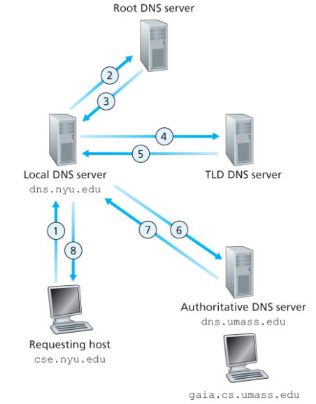

# DNS

DNS는 DNS 서버들의 계층구조로 구현된 분산 DB이다.

DNS 프로토콜은 UDP상에서 수행되고 포트번호는 53이다.

#### DNS가 UDP 프로토콜을 사용한 이유

UDP를 사용하는 이유는 일단 UDP는 연결 설정 비용이 추가적으로 들지 않는다. DNS가 전송하는 패킷들의 크기는 굉장히 작기 때문에 UDP가 유리하다. 이로 인해 크기가 작기 때문에 패킷이 전송중에 손실되어도 다시 보내면 된다. 
그리고 연결 상태를 유지할 수 있는 TCP와 다르게 연결 상태를 유지하지 않고 많은 클라이언트를 수용할 수 있는 UDP를 이용한 이유도 있다.

참고로 DNS 서버에 캐싱이 되어져 있어 DNS 서버로의 트래픽 감소에 도움을 준다. 

## DNS는 분산 계층 DB이다.

#### Root DNS Server

천개이상의 루트 DNS 서버가 전세계에 퍼져있다.
TLD 서버에 IP주소들을 제공한다. 

#### TLD DNS Server

.com, org, net, kr, uk등의 상위 레벨 도메인에 대한 서버를 의미한다.
Authoritative DNS 서버에 IP주소를 제공한다.

#### Authoritative DNS Server

#### 로컬 DNS Server

DNS 구조의 중심에 있다.

