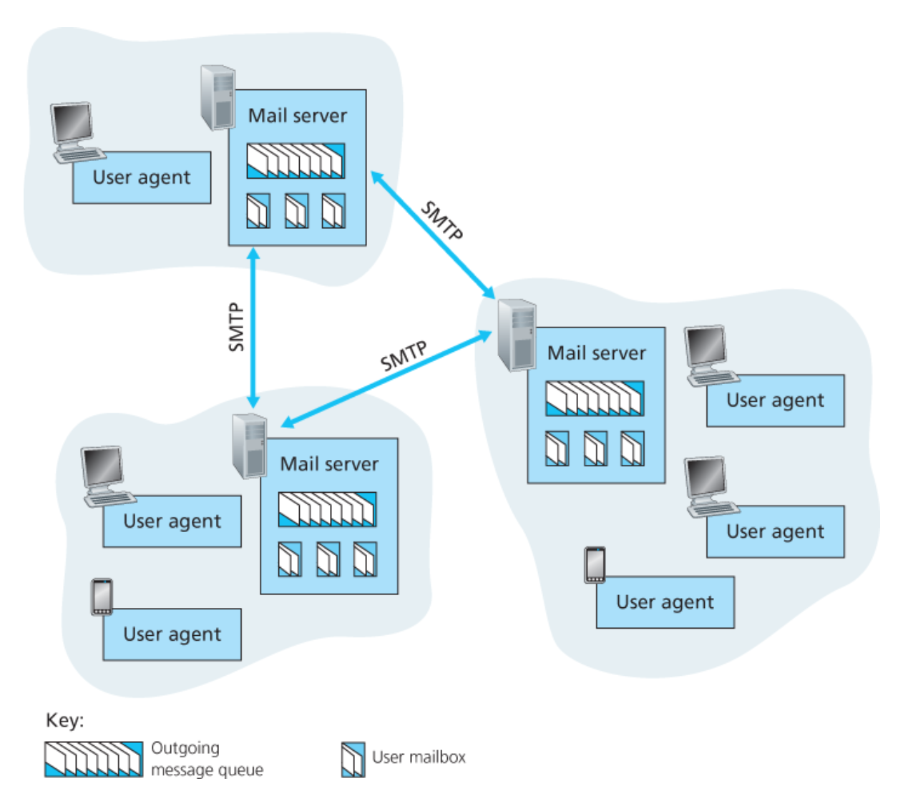

## 목차

[2.3.0 개요](#230-개요)  [2.3.1 SMTP](#231-SMTP)  [2.3.2 HTTP와 비교](#232-HTTP와-비교)  [2.3.3 메일 메시지 포맷](#233-메일-메시지-포맷)  [2.3.4 메일 접속 프로토콜](#234-메일-접속-프로토콜) 

## 2.3.0 개요

이 절에서는 인터넷 전자메일 구조의 중심에 있는 애플리케이션 계층 프로토콜을 알아본다. 이 프로토콜을 깊게 알아보기 전에 인터넷 메일 시스템과 그 주요 요소에 대한 상위 레벨의 관점이 필요하다. 사용자 에이전트(MS 아웃룩, 애플메일 등), 메일 서버, SMTP(Simple Mail Transfer Protocol) 3개의 주요 요소가 존재한다.

유저가 사용자 에이전트를 사용하여 **메일 메시지 작성**을 끝내면 사용자 에이전트는 **메시지를 메일 서버로** 보내고 거기서 메시지는 **메일 서버의 출력 메시지 큐**에 들어간다. 수신자가 메시지를 읽고 싶을 때 수신자의 사용자 에이전트는 메일 서버에 있는 메일 박스에서 메시지를 가져온다. 각 수신자는 **메일 서버 안에 메일박스**를 갖고있다. 송신자의 메일 서버를 거친 후에 수신자의 메일 서버로 전달된다.

송신자의 서버가 메일을 수신자의 서버로 전달할 수 없다면 송신자의 서버는 그 메시지를 메시지 큐 (message queue)에 보관하고 나중에 그 메시지를 전달하기 위해 다시 시도한다. 재시도는 약 30분마다 일어난다. 여러 날 시도해도 실패하면 서버는 그 메시지를 제거하고 송신자에게 전자메일로 이를 통보한다.

`SMTP`는 인터넷 전자메일을 위한 주요 애플리케이션 계층 프로토콜이다. SMTP는 메일을 송신자의 서버로부터 수신자의 메일 서버로 전송하는데 TCP의 신뢰적인 데이터 전송 서비스를 이용한다. 

## 2.3.1 SMTP

RFC 5321에 정의된 SMTP는 인터넷 전자메일의 중심이다. 이는 여러 장점이 있지만 오래된 기술이다. 모든 메일 메시지의 몸체는 단순한 7비트 ASCII이어야 한다는 단점이 있다. 이는 오늘날의 멀티미디어 시대에서는 7비트 ASCII 제한은 문제를 일으킨다. SMTP의 기본 동작을 설명하기 위해 예시를 들어본다.

1. 송신자는 전자메일 사용자 에이전트를 수행하고 메시지 전송을 명령한다.
2. 송신자의 사용자 에이전트는 메시지를 송신자의 메일서버에게 보내고 그곳에서 메시지는 메시지 큐에 놓인다.
3. 송신자의 메일 서버에서 동작하는 SMTP의 클라이언트 측은 메시지 큐에 있는 메시지를 본다. 수신자의 메일서버에서 수행되고 있는 SMTP 서버에게 TCP 연결을 설정한다.
4. 초기 SMTP handshaking 이후에 SMTP 클라이언트는 송신자의 메시지를 TCP 연결로 보낸다.
5. 수신자의 메일 서버 호스트에서 SMTP의 서버 측은 메시지를 수신한다. 수신자의 메일 서버는 그 메시지를 수신자의 메일박스에 놓는다.
6. 수신자는 원하는 시간에 그 메시지를 열람하기 위해 사용자 에이전트를 사용한다.

여기서 알 수 있는 특징은 SMTP가 메일을 보내는데 두 메일 서버가 먼 거리에 떨어져 있더라도 중간 메일서버를 사용하지 않는다는 것이다. TCP 연결은 두 서버 사이의 직접연결이다. 수신자의 메일서버가 다운되어 있다면 메시지는 어느 중간 메일 서버에 저장되는 것이 아니라 송신자의 메일서버에 남아 새로운 시도를 위해 기다린다.

다음은 SMTP가 메시지를 `송신 메일서버`에서 `수신 메일서버`로 전송하는 방식이다.

1. 클라이언트SMTP (송신메일서버호스트) 는 서버SMTP (수신메일서버호스트) 의 **25번 포트로 TCP 연결을 설정**한다.
2. 서버가 다운되어 있으면 클라이언트는 나중에 다시 시도한다.
3. 일단 이 연결이 설정되면, 서버와 클라이언트는 **애플리케이션 계층 handshaking을 수행**한다. 이 SMTP handshaking 과정 동안에 SMTP 클라이언트는 송신자의 전자메일 주소와 수신자의 전자메일 **주소를 제공**한다.
4. 이후 클라이언트는 **메시지를 전송**한다. SMTP는 서버에 오류 없이 메시지 전달을 위해 TCP의 신뢰적인 데이터 전송 서비스에 의존한다.
5. 서버에 보낼 다른 메시지가 있으면 클라이언트는 이 과정을 같은 TCP 연결상에서 반복하고 없다면 TCP에게 연결을 닫을것을 명령한다.

SMTP는 지속연결을 사용한다. 송신과 수신 메일서버 사이에 여러 메시지를 갖고 있다면 같은 TCP연결을 통해서 모든 메시지를 전달할 수 있다.

## 2.3.2 HTTP와 비교

지속 HTTP와 SMTP 모두 지속연결을 사용한다. 그러나 중요한 차이점이 있다.

1. HTTP는 원칙적으로 `풀(pull) 프로토콜`이고 SMTP는 `푸시(push) 프로토콜`이다.

   HTTP

   사용자가 서버로부터 정보를 가져오기 위해 HTTP를 사용한다. TCP 연결은 파일을 받을 컴퓨터가 먼저 초기화한다.

   SMTP

   송신 메일서버가 파일을 수신메일서버로 보낸다. TCP 연결은 파일을 보내는 컴퓨터에서 먼저 초기화한다.

2. SMTP는 각 메시지의 몸체를 포함하여 각 메시지가 7비트 ASCII 포맷일것을 요구한다.

   메시지가 7비트 ASCII가 아닌 문자를 포함하거나 이진 데이터(이미지 파일)을 포함한다면 그 메시지는 7비트 ASCII로 인코딩 되어야한다. HTTP는 이러한 제한이 없다.

3. 텍스트와 이미지(다른 미디어 타입도 포함)로 구성된 문서를 다루는 방법의 차이이다.

   HTTP는 자신의 HTTP 응답 메시지에 각 객체를 캡슐화한다. 인터넷 메일은 모든 메시지의 객체를 한 메시지로 만든다.

## 2.3.3 메일 메시지 포맷

헤더라인과 메시지 몸체(ASCII 문자)는 빈줄(CRLF)로 분리되며 모든 헤더는 From: 헤더라인과 To: 헤더라인을 반드시 가져야 한다. 헤더는 Subject: 헤더와 다른 옵션 헤더라인을 가질 수도 있다.

## 2.3.4 메일 접속 프로토콜

메일 서버는 메일 박스를 관리하고 SMTP의 클라이언트와 서버 측의 역할을 모두를 수행한다. 메일 서버는 전자메일의 수신을 위해 항상 켜져 있을 뿐더러 인터넷에 연결되어 있어야 한기 때문에 일반 사용자는 로컬 PC에서 사용자 에이전트를 수행하고 늘 켜져 있는 공유 메일 서버에 저장된 메일박스에 접근한다. 이 메일 서버는 보통 사용자들과 공유하고 전형적으로 사용자들의 ISP들이 유지관리한다.

SMTP는 하나의 호스트에서 다른 쪽으로 전자메일을 보내기 위해 설계되었다. 송신자 사용자 에이전트는 수신자 서버로 직접 대화하지 않는다. 송신자의 사용자 에이전트는 송신자의 메일서버로 SMTP를 이용하여 전자메일 메시지를 보낸다. 송신자의 메일 서버에 먼저 전자메일이 저장되고 송신자의 메일서버는 그 메시지를 수신자의 메일서버로 30분마다 반복해서 보내려고 한다.

로컬 PC에서 사용자 에이전트를 수신하는 수신자는 자신의 ISP 내부의 메일 서버에 있는 자신의 메시지를 얻기 위해 SMTP를 사용할 수 없다. 앞서 언급했듯이 SMTP는 push 프로토콜인 반면에 메시지를 얻는 것은 pull 동작이기 때문이다. 수신자의 메일서버에서 자신의 로컬 PC로 메시지를 전송하는 특별한 메일 액세스 프로토콜을 통해서 이러한 문제를 해결할 수 있다. `POP3` (Post Office Protocol-Version 3) 과 `IMAP` (Internet Mail Access Protocol), HTTP와 같은 몇가지 유명한 `메일 접속 프로토콜`이 있다.

### POP3

RFC 1939에 정의된 매우 간단한 메일 접속 프로토콜이다. 아주 간단하므로 매우 한정된 기능을 가진다. POP3는 사용자 에이전트가 메일 서버의 포트 110번 포트로 TCP연결을 열 때 시작한다. TCP 연결이 설정되면 POP3는 3단계 과정으로 진행한다. 인증, 트랜잭션, 갱신이다.

1. 인증

   사용자에이전트는 메일을 다운로드하는 사용자의 이증을 위해 계정과 비밀번호를 보낸다.

2. 트랜잭션

   사용자 에이전트는 메시지를 가져오고 삭제를 위해 메시지에 표시하거나 지울수도 있으며 메일 통계을 얻을 수 있다.

3. 갱신

   클라이언트가 POP3 세션을 끝내는 quit 명령이 내려진 후에 일어난다.이떄 메일서버는 삭제 표시된 메시지를 삭제한다.

### IMAP

POP3를 이용하여 수신자가 로컬 컴퓨터로 메시지를 다운로드하면 메일 폴더를 생성하고 다운로드된 메시지를 이동시킬 수 있고 삭제할 수 있다. 그러나 이 방법은 다른 컴퓨터에서도 접속할 수 있는 원격 서버에 폴더계층 구조를 유지해주는 방법을 제공하지 않는다.

이것과 또 다른 문제를 해결하기 위해 RFC3501에 정의된 IMAP이 만들어졌다. IMAP 서버는 폴더에 각각의 메시지를 연결한다. 처음 메시지가 서버에 도착하면 수신자의 INBOX 폴더와 연결된다. IMAP 프로토콜은 사용자가 폴더를 생성하고 다른 폴더로 메시지를 옮기는 명령을 제공한다. POP3과는 달리 IMAP 세션을 통해 사용자 상태 정보를 유지한다는 점이 큰 차이다.

### 웹 기반 전자메일

수신자가 자기 메일박스에 있는 메시지를 열람하고자 할 때 수신자의 메일서버로부터 POP3나 IMAP을 이용하는 대신에 HTTP 프로토콜을 이용하여 수신자의 브라우저로 전달될 수 있다.
