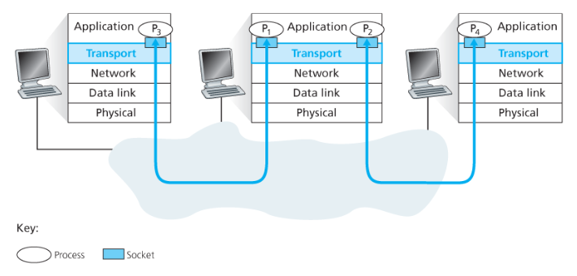

# 다중화와 역다중화

위 그림을 보면 각 호스트에 어플리케이션 계층에는 여러 프로세스가 존재하고 각 프로세스별로 소켓(포트번호)를 가지고 있다.

소켓을 통해 트랜스포트 계층의 세그먼트 정보를 어플리케이션 계층에게 전달할 수 있다. 그리고 각 소켓은 TCP인지 UDP인지 식별자를 가지게 된다.

하나의 호스트에는 여러 소켓이 존재하고 이를 식별하기 위해서 트랜스포트 계층에 세그먼트 필드 집합을 가지고 있어 정확한 소켓을 식별해 전해준다.

## 역다중화

상대 프로세스로부터 수신된 세그먼트들을 세그먼트 필드 집합(포트번호)을 확인해 트랜스포트 계층의 세그먼트 데이터를 올바른 소켓으로 전달하는 작업을 의미한다.

## 다중화

어플리케이션 계층에서 전달하고자 하는 메세지를 만들고 이를 소켓을 통해 트랜스포트 계층에 전달해 메세지가 세그먼트 형태로 캡슐화가 되고 이를 네트워크 계층으로 전달해 데이터그램으로 캡슐화를 하는 작업을 의미한다.

# 비연결형(UDP) 다중화와 역다중화

UDP 소켓은 출발지의 IP주소, 출발지의 포트번호 도착지의 IP주소 도착지의 포트번호와 여러 데이터가 답기게 되고 목적지에 도착해 역다중화가 되면서 이 때 
목적지의 IP주소와 포트번호로만 UDP 소켓이 식별된다. 

출발지의 정보는 식별하지 않기 때문에 누가 보낸지 모르고 이 때문에 UDP 통신이 비연결형이라고 한다.

# 연결형(TCP) 다중화와 역다중화

TCP는 식별하는 정보가 출발지의 IP주소와 포트번호를 추가적으로 식별하기 때문에 연결형이라고 부른다.

